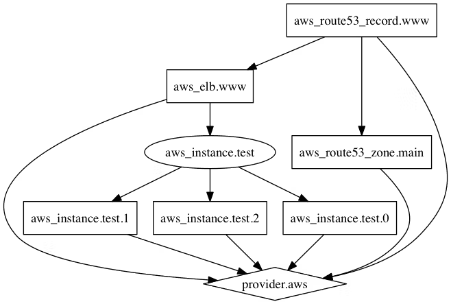

# Terraform Configurations

## Attributes

Each resource created in cloud environment has its own set of attributes. These are the fields in a resource that holds the value which end up in state file.

eg: ec2 instance have arrtibutes like id, public_ip, private_ip, instance_state, etc

### Cross Refrencing Resource Attributes

Terraform allows to use the attributes of a resource to be used in another resource.

Generic Syntax:

```
<RESOURCE_TYPE>.<NAME>.<ATTRIBUTE>
```

## Output Values

Ouput values make the information of the resources created available on the command line to be used by other Terraform configurations.

Generic syntax :

```
output "name" {
    value = <RESOURCE_TYPE>.<NAME>.<ATTRIBUTE>
}
```

Gives value of the specific attribute

```
output "name" {
    value = <RESOURCE_TYPE>.<NAME>
}
```

Gives values of the all the attributes

## Terraform Variables

Variables in terraform allows reuse of static values in easy manner without causing human error.

Generic syntax:

**_variable.tf_**

```
variable "var_name" {
    value = "value"
    description = "description of the declared variable"
}
```

**_main.tf_**

```

resource "res_name" "name" {
    attribute = var.var_name
}
```

Production working:

**_variable.tf_**

```
variable "var_name1" {}
variable "var_name2" {}
variable "var_name3" {}
```

**_\*.tfvars_**

```
var_name1 = "default value of variable"
var_name2 = "default value of variable"
var_name3 = "default value of variable"
```

**_main.tf_**

```

resource "res_name" "name" {
    attribute = var.var_name1
}
```

**If the file name is terrform.tfvars -> terrform apply, <br>
if other, like dev.tfvars or prod.tfvars -> terrform apply -var-file="file_name"**

### Variable Defination Precedence

Values of a single variable can be declared at multiple places, i.e in variables.tf, terraform.tfvars file, enviroment variable and -var or -var-file options

| Priority | Type                                        |
| :------: | :------------------------------------------ |
|    1     | -var or -var-file options in CLI            |
|    2     | \*.auto.tfvars or \*.auto.tfvars.json files |
|    3     | terraform.tfvars.json file                  |
|    4     | terraform.tfvars file                       |
|    5     | envornment variables                        |

## Data Types

`type` arrguement allows to restrict the type of value which will be accepted for the declared variable.

|  Type  | Description                                                                            |
| :----: | :------------------------------------------------------------------------------------- |
| string | sequence of unicode characters; "syash7202"                                            |
|  list  | sequential list of values, starting with 0; <br>["us-east-1", "us-east-2","us-east-3"] |
|  map   | a group of values identified as named labels; <br> {name:"Yash", age: 22}              |
| number | integer input; 7202                                                                    |
|  bool  | defines true or false                                                                  |
|  set   | unordered list with duplicate values are allowed                                       |

## Count & Count Index

Count parameter helps to create multiple resource of same kind.

```
resource "aws_instance" "web01" {
  ami           = "ami-080e1f13689e07408"
  instance_type = var.type["us-east-1"]
  security_groups = var.sg
  count = 3
# creates 3 instances as aws_instance-[0], aws_instance-[1], aws_instance-[2]

  tags = {
    Name = var.tag[0]
  }
}

```

Count index allows to fetech each iteration in the loop, helping having diffrent attributes for resources.

```
resource "aws_instance" "web01" {
  ami           = "ami-080e1f13689e07408"
  instance_type = var.type["us-east-1"]
  security_groups = var.sg
  count = 3
# creates 3 instances as aws_instance-[0], aws_instance-[1], aws_instance-[2]

  tags = {
    Name = "ec-2_with.${count.index}"
# Name = ec-2_with.0 for first instance , 1 & 2 for rest
  }
}

```

## Conditional Expression

uses the value of a bool expresion to select one of the two values.

Generic Syntax :

`condiiton ? true : false`

```
resource "aws_instance" "web01" {
  ami           = "ami-080e1f13689e07408"
  instance_type = var.type["us-east-1"]
  security_groups = var.sg
  count = var.condition_test == true ? 1 : 0
# check for condition variable value if true 1 instance will be created if false no instance will be created
  tags = {
    Name = "ec-2"
  }
}
```

## Local Values

allows to use the repetitive attribute declaration to be done in one go. Also supports multiple expressions.

```
locals {
   dev_tags = {
       Owner = "DevOps Team"
       service = "Pipeline"
   }
}

resource "aws_instance" "web01" {
  ami           = "ami-080e1f13689e07408"
  instance_type = var.type["us-east-1"]
  security_groups = var.sg
  tags = {
    Name = local.dev_tags
  }
}

resource "aws_instance" "mySQL01" {
  ami           = "ami-080e1f13689e07408"
  instance_type = var.type["us-east-1"]
  security_groups = var.sg
  tags = {
    Name = local.dev_tags
  }
}


```

## Terraform Functions

Terraform includes built-in fucntions.

Generic Syntax :

`function (arguement1, arguement2)`

https://developer.hashicorp.com/terraform/language/functions

## Data Source code

Data source code allows data to be fetched or computed for use elsewhere in Terraform configurations.

For example: if we need to configure ec2 instances, then we cannot always hard code the ami, thus to fetech the lastest configurations available we need data blocks and filter to search and given precise data.

```
provider "aws" {
  region = "us-east-1"
}

data "aws_ami" "app_ami" {
  most_recent = true
  owners = ["amazon"]
# owners can be official, self or any other.

filter {
  name = "name"
  values = ["amzn2-ami-hvm*"]
}
}

resource "aws_instance" "web01" {
  ami           = data.aws-ami.app.ami.id
  instance_type = var.type["us-east-1"]
  security_groups = var.sg

  tags = {
    Name = "test"
  }
}
```

**Resources for filter** : https://docs.aws.amazon.com/cli/latest/reference/ec2/describe-instances.html

## Debugging in Terraform

To enable detailed logs `TF_LOG` environment variable should be enabled to following :

| VALUE | DESCRIPTION                                                                                                                                  |
| :---: | -------------------------------------------------------------------------------------------------------------------------------------------- |
| TRACE | provides an extremely detailed account of every step taken by Terraform                                                                      |
| DEBUG | more advanced logging level debugging by providing a shorter, more sophisticated description of internal events compared to TRACE            |
| INFO  | helpful for logging general, high-level messages about the execution process or providing informative instructions, similar to a README      |
| WARN  | provides non-critical warnings in the log that may indicate errors or misconfigurations, allowing for adjustments to be made at a later time |
| ERROR | utilized when something is severely wrong and acts as a blocker, presenting errors that prevent Terraform from continuing                    |

**Enableing TF_LOG mode** : ` $ export TF_LOG="DEBUG"` <br>
**Disable TF_LOG mode** : `"$ unset TF_LOG"`

### Customize logs with TF_LOG_PATH

Once the log level has been configured, the TF_LOG_PATH environment variable can be set to specify the file location for Terraform's log output.

Customizing logs with TF_LOG_PATH in Terraform provides a simple and flexible way to manage your log output. By default, Terraform logs to stderr, which can make it difficult to keep track of the output, particularly when running multiple commands at once. By setting the TF_LOG_PATH environment variable, you can redirect Terraform's log output to a file of your choice.

`$ export TF_LOG_PATH="<path>/terraform-log"`

## Formatting in Terraform

To improve readability of the terraform code, `terraform fmt` command is used to rewrite Terraform configurations files to take care of the overall formatting.

Before fmt :


After fmt :


## Load Order & Semantics

Terraform generally loads all the configuration files within the directoy specified in alphabetical order. The files must end in either `.tf` or `.tf.json` to specify teh format that is in use.

## Dynamic Blocks

Dynamic block allows to dynamically construct repeatable nested blocks which is supported inside resource, data, provider & provisioner blocks.

**Example** : having multiple ingress blocks for diffrent inbound rules in the same security group, one can define list of all rules and dyanmaic block which will given repeated values to each item in list.

```
variable "sg_ports" {
  type        = list(number)
  description = "list of ingress ports"
  default     = [8200, 8201, 8301, 9200, 9600]
}

resource "aws_security_group" "dynamic_sg" {
  name        = "dynamic_sg"
  description = "Ingress for dyanamic block testing"

  dynamic "ingress" {
    for_each = var.sg_ports
    content {
      from_port   = ingress.value
      to_port     = ingress.value
      protocol    = "tcp"
      cidr_blocks = ["0.0.0.0/0"]
    }

  }

}

```

- `Iterator` : instead of having dynamic block name in content we can have a iterator value for each item

```
  dynamic "ingress" {
    for_each = var.sg_ports
    iterator = port
    content {
      from_port   = port.value
      to_port     = port.value
      protocol    = "tcp"
      cidr_blocks = ["0.0.0.0/0"]
    }
  }

```

## Tainting Terraform Resources

The -replace option with terraform apply, forces to replace the specified resource and recreate it. Genrally done when manuall adjustments are done to infrastructure and one has to roll back.

Generic Syntax : `terraform apply -replace-"aws_instance.web01"`

Sample code :

```

 resource "aws_instance" "web01" {
   ami           = "ami-080e1f13689e07408"
   instance_type = "t2.micro"
   security_groups = [aws_security_group.web01-sg.name]

   tags = {
     Name = "Test"
   }
 }
```

With above command, this specific infrastructure will be destroyed over cloud and recreated with give configurations in Terraform files.

Simailar functionality was provided using `terraform taint` but in version after v0.15.2 & later -replace is used.

## Splat Expression

Splat expression gives us list of all the attributes. [*]

```
resource "aws_iam_user" "test" {
  name = "user.${count.index}"
  count = 3
  path = "/bin/"

}

output "arns" {
  value = aws_iam_user.test.[*].arn
}
```

## Terraform Graph

the `terraform graph` command is used to generate a visual representation of either a configuration or execution plan.

The output is in the form of DOT format, which is easily converted to an image.

Sample output :



## Terraform Plan File

The generated terraform plan can be saved to a specific path. This plan can than be used with terraform apply to be certain that only the changes shown in the plan are applied.

Generic Syntax :

`terraform plan -out = filename`

**_ Just file name will generate a binary file in same directory or a proper path should be given _**

Executing that path :

`terraform apply <filename/path>`

## Terraform Output

The `terraform output` command is used to extract the value of an output variable from the state file.

Generic syntax :

`terraform ouput <attribute>`

## Terraform Settings

Terraform block to setup configuration settings for terrform like version, providers, etc

```
terraform {
  required version = "> 0.12.0"
  required providers {
    mycloud = {
      source = "mycorp/mycloud"
      version = "~> 1.0"
    }
  }
}

```

## ZipMap Function

The zipmap fucntion constructs a map from a list of keys & a corresponding list of values.

Generic Syntax :

`zipmap(keylist, valuelist)`

Exapmle :

`zipmap (["a","b","c"],[1,2,3])`

Output :

```
{
  "a" = 1,
  "b" = 2,
  "c" = 3
}
```

## Terraform Comments

|    Type     | Description         |
| :---------: | :------------------ |
|      #      | single line comment |
|     //      | single line comment |
| /\* and \*/ | multi line comment  |

## Resource Behaviour and Meta Arguments

Terraform allows to include meta-argument within the resource block which allows some details of this standard rsource behaviour to be customized on a pre-resource basis.

```
resource "aws_iam_user" "test" {
  name = "user.${count.index}"
  count = 3
  path = "/bin/"

  tags = {
    Name = "test"
  }

  lifecyle {
    ignore_changes = [tags]
  }
}
```

The given sample code will ignore the manual changes done to theresource regarding tags.

Types of Meta-Arguments :

| Meta-Arguement |                                       Description                                        |
| :------------: | :--------------------------------------------------------------------------------------: |
|   depends_on   | handle hidden resource or module dependencies that terraform cannot automatically infer. |
|     count      |         accepts as whole number, and create that many instances of that resource         |
|    for_each    |   accpects map or set of strings, & create an instance for each item in the map or set   |
|   lifecycle    |                      allows modification of the resource lifecycle                       |
|    provider    |               specifies which provider configuration to use for a resource               |

## Lifecycle Meta-Argument

|       Argument        |                                                            Description                                                             |
| :-------------------: | :--------------------------------------------------------------------------------------------------------------------------------: |
| create_before_destroy |                             new replacement object is created first, & then prior object is destroyed                              |
|    prevent_destroy    |                           reject any plan that destroys the instructure object associated with resource                            |
|    ignore_changes     | ignore certain changes to the live resource that does not match the configuration but also when enabled doesn't update via TF also |
| replace_triggered_by  |                                    replaces the resource when any of the refernced items change                                    |

### Create Before Destroy Argument

**Default Behaviour** : when TF cannot change a resource argument because of no in-place updatation due to API limitations, then TF will destroy the existing object & then create a new replacement object with the new configured arguements.

example: the AMI of an ec2 instance is changed.

With use of **create_before_destroy** meta-argument new replacement is created first then privious is destroyed.

```
resource "aws_iam_user" "test" {
  name = "user.${count.index}"
  count = 3
  path = "/bin/"

  tags = {
    Name = "test"
  }

  lifecyle {
    create_before_destroy = true
  }
}
```

### Prevent Destroy Argument

With use of **prevent_destroy** meta-argument any terraform plan cannot destroy object created from that resource.

**NOTE** : this doesn't prevent destroying the infrastructure if the resource block is removed from the configurations

```
resource "aws_iam_user" "test" {
  name = "user.${count.index}"
  count = 3
  path = "/bin/"

  tags = {
    Name = "test"
  }

  lifecyle {
    prevent_destroy = true
  }
}
```
