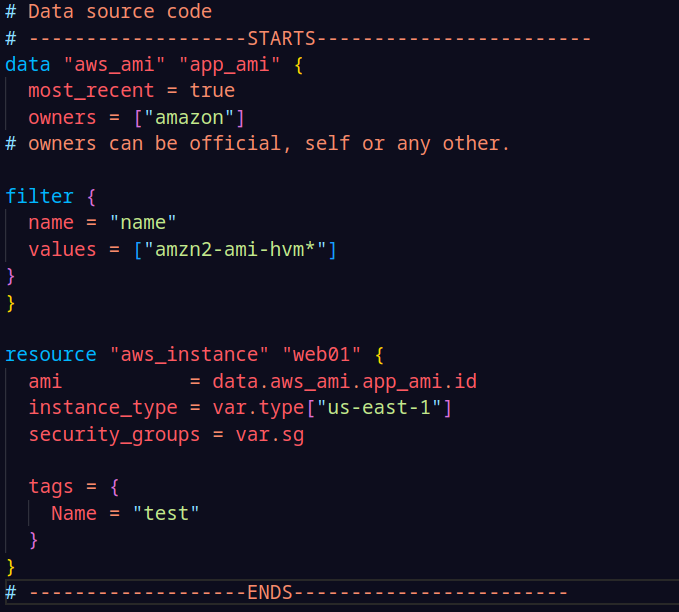
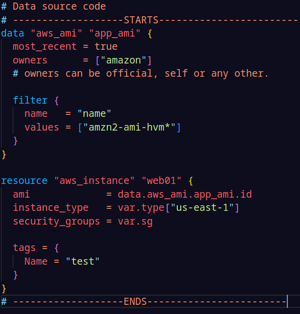

# Terraform Configurations

## Attributes

Each resource created in cloud environment has its own set of attributes. These are the fields in a resource that holds the value which end up in state file.

eg: ec2 instance have arrtibutes like id, public_ip, private_ip, instance_state, etc

### Cross Refrencing Resource Attributes

Terraform allows to use the attributes of a resource to be used in another resource.

Generic Syntax:

```
<RESOURCE_TYPE>.<NAME>.<ATTRIBUTE>
```

## Output Values

Ouput values make the information of the resources created available on the command line to be used by other Terraform configurations.

Generic syntax :

```
output "name" {
    value = <RESOURCE_TYPE>.<NAME>.<ATTRIBUTE>
}
```

Gives value of the specific attribute

```
output "name" {
    value = <RESOURCE_TYPE>.<NAME>
}
```

Gives values of the all the attributes

## Terraform Variables

Variables in terraform allows reuse of static values in easy manner without causing human error.

Generic syntax:

**_variable.tf_**

```
variable "var_name" {
    value = "value"
    description = "description of the declared variable"
}
```

**_main.tf_**

```

resource "res_name" "name" {
    attribute = var.var_name
}
```

Production working:

**_variable.tf_**

```
variable "var_name1" {}
variable "var_name2" {}
variable "var_name3" {}
```

**_\*.tfvars_**

```
var_name1 = "default value of variable"
var_name2 = "default value of variable"
var_name3 = "default value of variable"
```

**_main.tf_**

```

resource "res_name" "name" {
    attribute = var.var_name1
}
```

**If the file name is terrform.tfvars -> terrform apply, <br>
if other, like dev.tfvars or prod.tfvars -> terrform apply -var-file="file_name"**

### Variable Defination Precedence

Values of a single variable can be declared at multiple places, i.e in variables.tf, terraform.tfvars file, enviroment variable and -var or -var-file options

| Priority | Type                                        |
| :------: | :------------------------------------------ |
|    1     | -var or -var-file options in CLI            |
|    2     | \*.auto.tfvars or \*.auto.tfvars.json files |
|    3     | terraform.tfvars.json file                  |
|    4     | terraform.tfvars file                       |
|    5     | envornment variables                        |

## Data Types

`type` arrguement allows to restrict the type of value which will be accepted for the declared variable.

|  Type  | Description                                                                            |
| :----: | :------------------------------------------------------------------------------------- |
| string | sequence of unicode characters; "syash7202"                                            |
|  list  | sequential list of values, starting with 0; <br>["us-east-1", "us-east-2","us-east-3"] |
|  map   | a group of values identified as named labels; <br> {name:"Yash", age: 22}              |
| number | integer input; 7202                                                                    |
|  bool  | defines true or false                                                                  |

## Count & Count Index

Count parameter helps to create multiple resource of same kind.

```
resource "aws_instance" "web01" {
  ami           = "ami-080e1f13689e07408"
  instance_type = var.type["us-east-1"]
  security_groups = var.sg
  count = 3
# creates 3 instances as aws_instance-[0], aws_instance-[1], aws_instance-[2]

  tags = {
    Name = var.tag[0]
  }
}

```

Count index allows to fetech each iteration in the loop, helping having diffrent attributes for resources.

```
resource "aws_instance" "web01" {
  ami           = "ami-080e1f13689e07408"
  instance_type = var.type["us-east-1"]
  security_groups = var.sg
  count = 3
# creates 3 instances as aws_instance-[0], aws_instance-[1], aws_instance-[2]

  tags = {
    Name = "ec-2_with.${count.index}"
# Name = ec-2_with.0 for first instance , 1 & 2 for rest
  }
}

```

## Conditional Expression

uses the value of a bool expresion to select one of the two values.

Generic Syntax :

`condiiton ? true : false`

```
resource "aws_instance" "web01" {
  ami           = "ami-080e1f13689e07408"
  instance_type = var.type["us-east-1"]
  security_groups = var.sg
  count = var.condition_test == true ? 1 : 0
# check for condition variable value if true 1 instance will be created if false no instance will be created
  tags = {
    Name = "ec-2"
  }
}
```

## Local Values

allows to use the repetitive attribute declaration to be done in one go. Also supports multiple expressions.

```
locals {
   dev_tags = {
       Owner = "DevOps Team"
       service = "Pipeline"
   }
}

resource "aws_instance" "web01" {
  ami           = "ami-080e1f13689e07408"
  instance_type = var.type["us-east-1"]
  security_groups = var.sg
  tags = {
    Name = local.dev_tags
  }
}

resource "aws_instance" "mySQL01" {
  ami           = "ami-080e1f13689e07408"
  instance_type = var.type["us-east-1"]
  security_groups = var.sg
  tags = {
    Name = local.dev_tags
  }
}


```

## Terraform Functions

Terraform includes built-in fucntions.

Generic Syntax :

`function (arguement1, arguement2)`

https://developer.hashicorp.com/terraform/language/functions

## Data Source code

Data source code allows data to be fetched or computed for use elsewhere in Terraform configurations.

For example: if we need to configure ec2 instances, then we cannot always hard code the ami, thus to fetech the lastest configurations available we need data blocks and filter to search and given precise data.

```
provider "aws" {
  region = "us-east-1"
}

data "aws_ami" "app_ami" {
  most_recent = true
  owners = ["amazon"]
# owners can be official, self or any other.

filter {
  name = "name"
  values = ["amzn2-ami-hvm*"]
}
}

resource "aws_instance" "web01" {
  ami           = data.aws-ami.app.ami.id
  instance_type = var.type["us-east-1"]
  security_groups = var.sg

  tags = {
    Name = "test"
  }
}
```

**Resources for filter** : https://docs.aws.amazon.com/cli/latest/reference/ec2/describe-instances.html

## Debugging in Terraform

To enable detailed logs `TF_LOG` environment variable should be enabled to following :

| VALUE | DESCRIPTION                                                                                                                                  |
| :---: | -------------------------------------------------------------------------------------------------------------------------------------------- |
| TRACE | provides an extremely detailed account of every step taken by Terraform                                                                      |
| DEBUG | more advanced logging level debugging by providing a shorter, more sophisticated description of internal events compared to TRACE            |
| INFO  | helpful for logging general, high-level messages about the execution process or providing informative instructions, similar to a README      |
| WARN  | provides non-critical warnings in the log that may indicate errors or misconfigurations, allowing for adjustments to be made at a later time |
| ERROR | utilized when something is severely wrong and acts as a blocker, presenting errors that prevent Terraform from continuing                    |

**Enableing TF_LOG mode** : ` $ export TF_LOG="DEBUG"` <br>
**Disable TF_LOG mode** : `"$ unset TF_LOG"`

### Customize logs with TF_LOG_PATH

Once the log level has been configured, the TF_LOG_PATH environment variable can be set to specify the file location for Terraform's log output.

Customizing logs with TF_LOG_PATH in Terraform provides a simple and flexible way to manage your log output. By default, Terraform logs to stderr, which can make it difficult to keep track of the output, particularly when running multiple commands at once. By setting the TF_LOG_PATH environment variable, you can redirect Terraform's log output to a file of your choice.

`$ export TF_LOG_PATH="<path>/terraform-log"`

## Formatting in Terraform

To improve readability of the terraform code, `terraform fmt` command is used to rewrite Terraform configurations files to take care of the overall formatting.

Before fmt :



After fmt :


