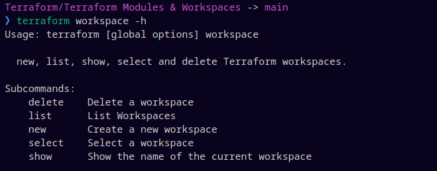

# Terraform Modules

Modules are containers for multiple resources that are used together. A module consists of a collection of `.tf` and/or `.tf.json` files kept together in a directory.

Modules are the main way to package and reuse resource configurations with Terraform.

Modules/ec2.tf :

```
 resource "aws_instance" "web01" {
   ami           = "ami-080e1f13689e07408"
   instance_type = var.instance_type
   tags = {
     Name = local.tags
   }
 }

 locals {
   tags = "test_with_local"
 }


```

Modules/variable.tf :

```
variable "instance_type" {
    default = "t1.micro"

}
```

project.tf :

```
provider "aws" {
    region = "us-east-1"
}

module "web01-module" {
    source = "./Modules"
    instance_type = "t2.micro"
}
```

To access the module ouput the genric syntax is : `module.<moudule-name>.<output-name>`

## Terraform Registry

The TF registry is a repository of modules written by Terrform community.
One can have modules maintained by third party vendors but are verfied by terraform.

## Terraform Module Publishing Requirements

|        Requirement        |                         Description                          |
| :-----------------------: | :----------------------------------------------------------: |
|          Github           |            module must be on a Github public repo            |
|           Named           |            format : terraform-\<provider>-\<name>            |
|  Repository Description   |         used to populate short descripiton of module         |
| Standard module structure |            adhere main standard module structure             |
|  x.y.z tags for releases  | uses tags to identify module versions i.e: v0.1.2 or 12.0.21 |

## Terraform Workspaces

TF allows to have multiple workspaces, with each workspace it can have different set of environment varibales associated.

Terraform Workspace commands :



```
 resource "aws_instance" "web01" {
   ami           = "ami-080e1f13689e07408"
   instance_type = lookup(var.instance-type,terraform.workspace)
   tags = {
     Name = "Workspace-Testing"
   }
 }

variable "instance-type" {
    type = map(string)

    default = {
      "default" = "t1.micro"
      "dev" = "t2.micro"
      "prod" = "t2.large"
    }

}
```

**Note** : the tf-state files for each workspace is stored seprately.
